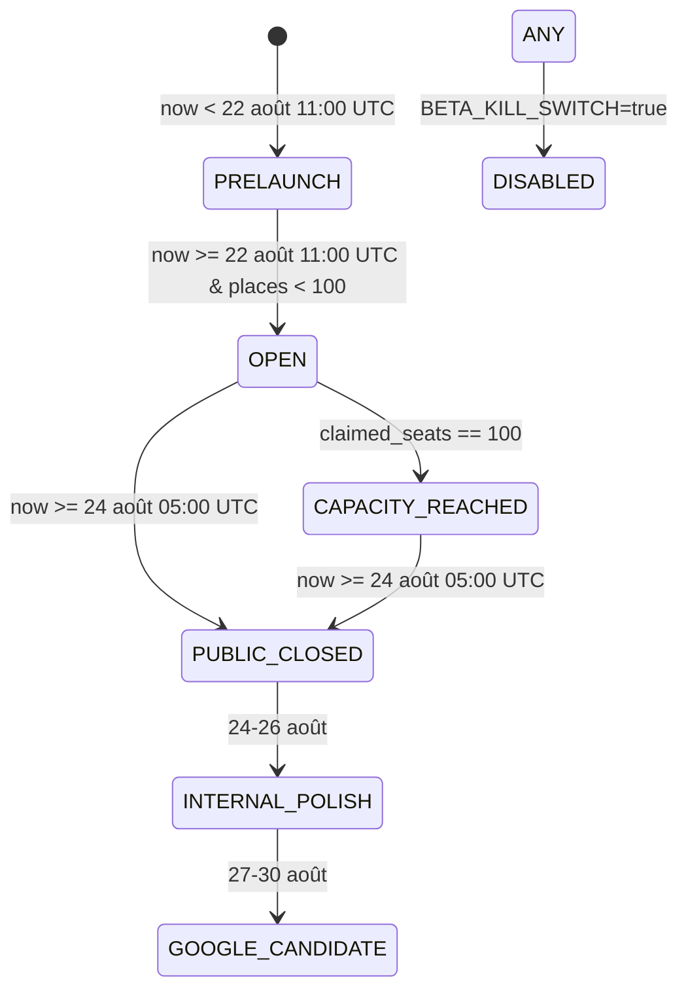

# Ñkyel AI — Beta Operations & State Machine Protocol
**SmartANDJ AI Technologies** · **Founder : Daniel Jonathan ANDJ**

---

## 1. Calendrier & Fenêtre Stricte de 42 Heures

Toutes les heures serveur sont calculées en **UTC**, et affichées aux testeurs en **Africa/Libreville (UTC+1)**.

| Étape | Date & Heure UTC | Date & Heure Libreville | Description |
|---|---|---|---|
| **Ouverture Bêta** | `2026-08-22T11:00:00Z` | **22 août 2026 à 12h00** | Début des inscriptions (100 places max) |
| **Clôture Publique** | `2026-08-24T05:00:00Z` | **24 août 2026 à 06h00** | Fin des appels modèles / historique en lecture seule |
| **Durée Réelle** | **42 heures** | **42 heures** | Fenêtre exceptionnelle calibrée |
| **Période de Polish** | `2026-08-24 – 2026-08-26` | 24 au 26 août | Analyse des retours & corrections |
| **Google Candidate** | `2026-08-27 – 2026-08-28` | 27 au 28 août | Validation sur `demo.nkyel.smartandjai.com` |
| **Dossier & Soumission** | `2026-08-29 – 2026-08-30` | 29 au 30 août | Soumission officielle Google AI |

> [!IMPORTANT]
> **Message officiel immuable :**  
> « 100 accès gratuits. Fenêtre exceptionnelle du 22 août à 12h00 au 24 août à 06h00, heure de Libreville. »

---

## 2. États Serveur de la Bêta



---

## 3. Matrice d'Accès & Comportements

| État | Visiteur Public | Testeur Inscrit (1..100) | Reviewer Google | Administrateur |
|---|---|---|---|---|
| `PRELAUNCH` | Countdown & Explication | Countdown | Démo Isolée | Accès Total |
| `OPEN` | Bouton inscription (si place dispo) | Accès complet aux capacités | Démo Isolée | Accès Total |
| `CAPACITY_REACHED` | Liste d'attente | Accès complet | Démo Isolée | Accès Total |
| `PUBLIC_CLOSED` | Écran de fin & Liste d'attente | Lecture seule & Feedback | Démo Isolée | Accès Total |
| `INTERNAL_POLISH` | Écran de fin | Lecture seule & Feedback | Démo Isolée | Accès Total |
| `GOOGLE_CANDIDATE` | Écran de fin | Lecture seule | Accès Démo Optimisé | Accès Total |

---

## 4. Procédures d'Urgence & Commandes SRE

### Forcer un état en urgence :
```env
BETA_FORCE_STATE=CAPACITY_REACHED
# ou
BETA_FORCE_STATE=PUBLIC_CLOSED
```

### Kill Switch Immédiat (Bloque tout appel LLM et génération) :
```env
BETA_KILL_SWITCH=true
```

### Export des métriques en direct pour l'équipe :
```bash
curl -X GET "https://api.nkyel.smartandjai.com/api/v1/beta/admin/export?format=json" \
  -H "Authorization: Bearer ADMIN_TOKEN" > beta_metrics_export.json
```
