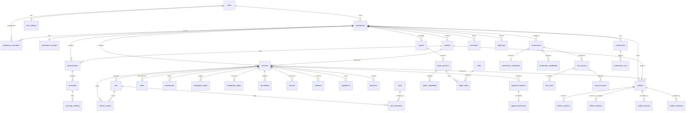

# Diagramme Entité-Relation (ERD) — Modèle de Données Canonique Ñkyel

```mermaid
erDiagram
    users ||--o{ workspaces : "owns"
    users ||--o{ workspace_members : "participates"
    users ||--o| user_settings : "has"
    workspaces ||--o{ workspace_members : "contains"
    workspaces ||--o| workspace_settings : "has"
    workspaces ||--o{ projects : "contains"
    workspaces ||--o{ conversations : "contains"
    workspaces ||--o{ missions : "contains"
    workspaces ||--o{ agents : "manages"
    workspaces ||--o{ connections : "configures"
    workspaces ||--o{ artifacts : "owns"
    workspaces ||--o{ automations : "runs"
    workspaces ||--o{ memories : "stores"
    workspaces ||--o{ audit_logs : "records"

    projects ||--o{ conversations : "links"
    projects ||--o{ missions : "organizes"
    projects ||--o{ artifacts : "groups"

    conversations ||--o{ messages : "contains"
    messages ||--o{ message_artifacts : "links"

    missions ||--o{ runs : "executes"
    missions ||--o{ mission_events : "emits"
    missions ||--o{ tasks : "decomposes"
    missions ||--o{ checkpoints : "saves"
    missions ||--o{ workgraph_nodes : "graphs"
    missions ||--o{ workgraph_edges : "connects"
    missions ||--o{ simulations : "predicts"
    missions ||--o{ sources : "discovers"
    missions ||--o{ evidence : "extracts"
    missions ||--o{ hypotheses : "tests"
    missions ||--o{ decisions : "records"
    missions ||--o{ approval_requests : "requests"
    missions ||--o{ artifacts : "produces"

    runs ||--o{ mission_events : "traces"
    runs ||--o{ tool_executions : "logs"

    agents ||--o{ agent_versions : "versions"
    agent_versions ||--o{ agent_capabilities : "enables"
    agent_versions ||--o{ agent_skills : "uses"
    skills ||--o{ agent_skills : "linked_to"

    tools ||--o{ tool_executions : "invoked_by"

    connections ||--o| connection_credentials : "secures"
    connections ||--o{ connection_capabilities : "exposes"
    connections ||--o{ mcp_servers : "integrates"
    mcp_servers ||--o{ mcp_tools : "provides"
    mcp_servers ||--o{ mcp_resources : "exposes"

    artifacts ||--o{ artifact_versions : "versions"
    artifacts ||--o{ artifact_relations : "sources_or_targets"
    artifacts ||--o{ artifact_sources : "grounded_in"
    artifacts ||--o{ artifact_evidence : "justified_by"

    automations ||--o{ automation_runs : "triggers"
    approval_requests ||--o| approval_decisions : "concludes"
```
