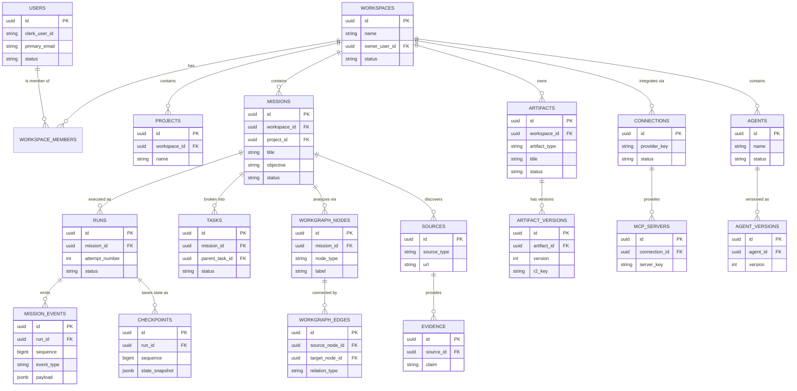

# Ñkyel Database ERD

This Entity-Relationship Diagram represents the core domain models for the Ñkyel agentic platform.
Due to the sheer size of the schema (50+ tables), this diagram focuses on the most critical entities and relationships.

